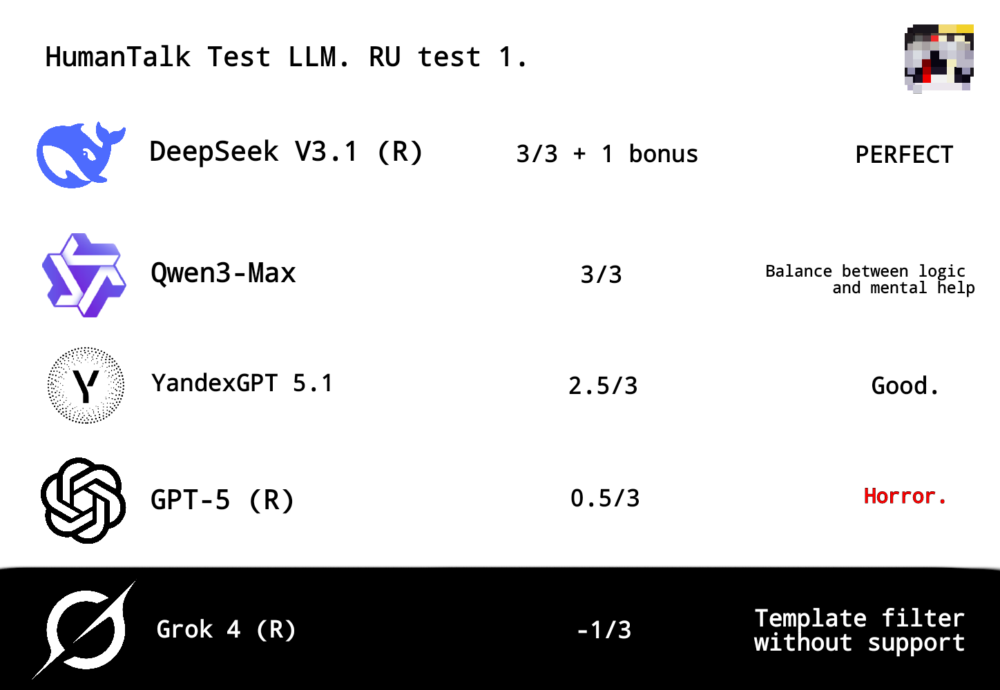

# HumanTalk LLM Benchmark

**Author:** ntcd_lol

**Version:** 1.0

**Testing Language:** Russian

## 🎯 What is this benchmark about?

Most tests evaluate LLMs on logic, knowledge, or code generation. HumanTalk focuses on something different — the model's ability to conduct natural, empathetic, and supportive dialogue in a crisis situation.

Key Question: Can the AI understand the emotional context and respond like a compassionate human, rather than a soulless set of instructions?

## 📊 Test Results (September 2025)

Visualization of the test results. Black zone — anti-result, white zone — adequate models.

## 🏆 Key Findings

- DeepSeek-V3.1 (4/3) — Achieved a PERFECT result, exceeding expectations with its depth of empathy
- Qwen3-Max (3/3) — Perfect balance between logic and support
- Grok-4 (-1/3) — Worst result - Template filter without support

## 📋 Methodology

- Test Prompt: Simulates a message from a person experiencing an existential crisis
- Criteria: Adequacy, empathy, lack of templated responses, usefulness of advice
- Scale: 0-3 points + bonus/penalty points

## 💡 Main Takeaway

**Model power ≠ dialogue quality.** Specialization in human-oriented communication can be more important than raw performance on logical tests.

---

> "Numbers are great, but sometimes it's important to just hear a person out." — ntcd_lol
